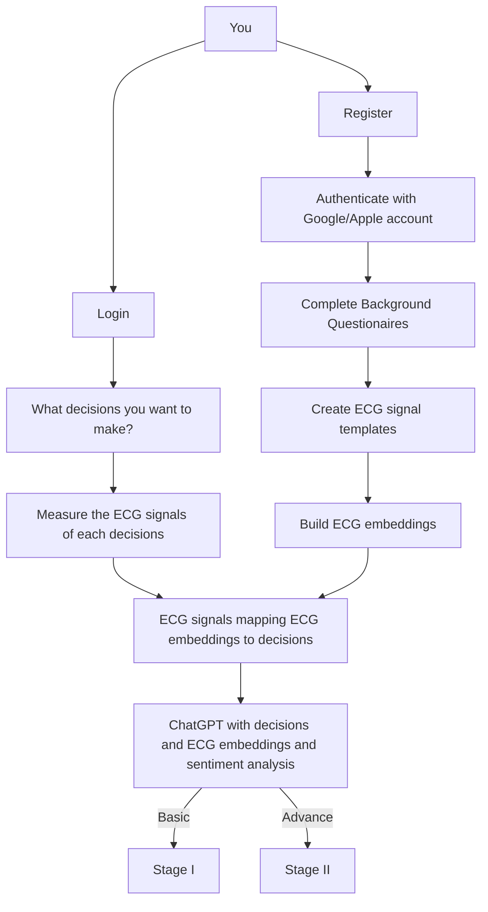
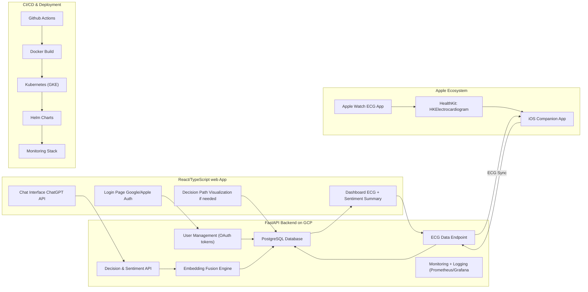
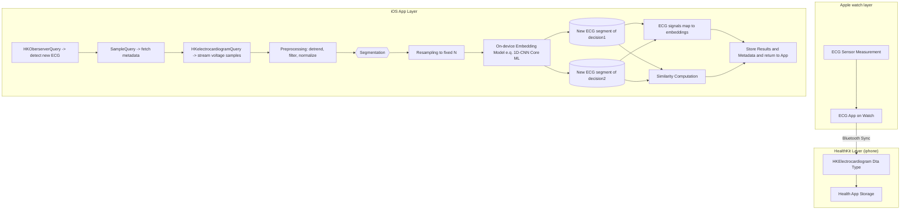

# Heart Tells

## What does Heart Tells do?
Making a hard decision? Put down two decisions and let your heart tell you.
Stages include negative, highly positive, positive, and neutral.
Use Chatgpt to help you go through the logic of the choices and explaining what your heart feeling by ECG signals respectively.
And help you to balance your mind and heart.

## Features
#### Login/Register and User Onboarding
    - platform: Web app (Progressive Web App support for mobile)
    - Authentication: 
        - Sign up/in with Google (OAuth 2.0)
        - Sign up/in with Apple (OAuth 2.0)
        - Sign up/in with email/password
    - Questionaaier (User management):
        - Background questionaire
        - ECG signal template questionaire
    - User management:
        - User profile
        - User settings
        - User authentication

#### User Flow
    - auth with google account or apple account
    - questionaires to understand brief background
    - record ECG signals and heart rate (5 2seconds segments)

#### Stage I
    - chat with chatgpt and leave two choices
    - sentiment analysis of the choices
    - logic of the choices
    - sentiment analysis of the ECG signals and heart rate
    - loca embeddings of the decisions and ECG signals
    - output the small summary of the decisions and ECG signals

#### Stage II
    - Able to advance make the path of the decisions to track progress and make decisions modularly.
    - output the small summary of the decisions path and confidence feeling of the decisions

## Tech Stack
    - auth: Google, Apple
    - Frontend: React, Typescript
    - Backend: FastAPI, PostgreSQL
    - NLP: ChatGPT, ECG signals, ECG embeddings, sentiment analysis
    - Deployment: GCP
    - CI/CD: Github Actions
    - Others: Docker, Kubernetes, Helm, Prometheus, Grafana (monitoring)
    - connect to google calendar or anki schedular

## user Flowchart

## Architecture  (Check for better display)

## Connect to Apple Watch to get ECG signals (Check for better display)

## How to use it?
