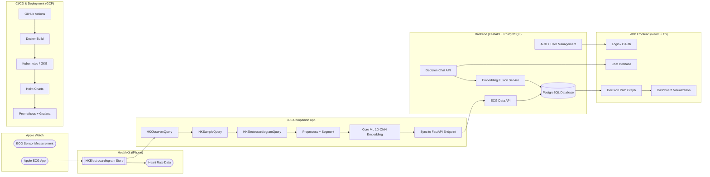

Excellent 👏 — here’s a production-ready **`docs/architecture.md`** file to pair with your README.
It documents your system’s **Apple Watch ↔ HealthKit ↔ FastAPI** pipeline, **ECG segment embedding**, and **decision-fusion flow**.
You can save it as `docs/architecture.md` in your repo (works perfectly with GitHub’s built-in Markdown renderer).

---

# 🧠 System Architecture

> **Emotion-Aware Decision Tracker**
> Integrating Apple Watch ECG signals, HealthKit APIs, ChatGPT, and on-device embeddings.

---

## 📡 High-Level Overview



---

## ⚙️ Data Flow Summary

| Step | Component                                    | Function                                           | Output                    |
| ---- | -------------------------------------------- | -------------------------------------------------- | ------------------------- |
| 1️⃣  | **Apple Watch ECG App**                      | Records 30 s Lead I ECG                            | Raw waveform              |
| 2️⃣  | **HealthKit (HKElectrocardiogram)**          | Stores ECG + metadata (heart rate, classification) | ECG entries in Health app |
| 3️⃣  | **HKObserverQuery**                          | Detects new ECG samples                            | Triggers fetch            |
| 4️⃣  | **HKSampleQuery + HKElectrocardiogramQuery** | Streams per-sample voltages (t, mV)                | Time-voltage series       |
| 5️⃣  | **Preprocessing (Swift)**                    | Detrend · filter · normalize                       | Clean ECG                 |
| 6️⃣  | **Segmentation (Swift)**                     | Slice into 3 consecutive 2 s windows               | Segments(1–3)             |
| 7️⃣  | **Core ML 1D-CNN**                           | Convert each segment → 128-dim embedding           | E₁, E₂, E₃                |
| 8️⃣  | **FastAPI Endpoint**                         | Receives embeddings + metadata                     | JSON payload              |
| 9️⃣  | **Fusion Engine (FastAPI / Python)**         | Combine ECG + decision text + sentiment            | Unified embedding         |
| 🔟   | **PostgreSQL + React Dashboard**             | Store & visualize decision paths                   | Trend + confidence graphs |

---

## 🧩 Apple Watch ↔ HealthKit ↔ Backend Pipeline

### Data Types Used

* `HKElectrocardiogramType` → ECG waveform samples
* `HKQuantityType(.heartRate)` → Heart rate (BPM)
* Optional: `HKCategoryType(.mindfulSession)` for tagging relaxation sessions

### Queries

```swift
let ecgType = HKObjectType.electrocardiogramType()
let query = HKSampleQuery(sampleType: ecgType,
                          predicate: nil,
                          limit: 1,
                          sortDescriptors: [NSSortDescriptor(key: HKSampleSortIdentifierEndDate, ascending: false)]) { ... }
```

### Background Delivery

* `HKObserverQuery` enables background fetch when new ECG arrives.
* App fetches, preprocesses, segments, and uploads data via REST API.

### Upload Schema (JSON)

```json
{
  "user_id": "uuid",
  "ecg_id": "HK-UUID",
  "segments": [
    {"index":1, "start":0.0, "end":2.0, "embedding":[...128 floats...]},
    {"index":2, "start":2.0, "end":4.0, "embedding":[...128 floats...]},
    {"index":3, "start":4.0, "end":6.0, "embedding":[...128 floats...]}
  ],
  "avg_heart_rate": 72.5,
  "timestamp": "2025-10-22T12:45:00Z"
}
```

---

## 🧠 Embedding Model (1D-CNN Core ML)

| Layer           | Filters / Units | Kernel / Stride | Activation |
| --------------- | --------------- | --------------- | ---------- |
| Conv1D          | 16              | 9 / 2           | ReLU       |
| Conv1D          | 32              | 9 / 2           | ReLU       |
| Conv1D          | 64              | 9 / 2           | ReLU       |
| Global Avg Pool | —               | —               | —          |
| Dense           | 128             | —               | Linear     |
| L2 Norm         | —               | —               | —          |

**Input:** `[1, 1, 1024]` normalized ECG segment
**Output:** `[1, 128]` embedding vector (L2-normalized)
**Loss during training:** Contrastive / InfoNCE
**Conversion:** `coremltools.convert(torch_model, inputs=[ct.TensorType(shape=(1,1,1024))])`

---

## 🧬 Decision Fusion Engine

```python
# Simplified FastAPI fusion endpoint
@app.post("/fusion/")
async def fuse(data: FusionInput):
    ecg_emb = np.array(data.ecg_embedding)
    text_emb = text_encoder.encode(data.decision_text)
    sentiment = sentiment_model.predict(data.decision_text)
    fused = np.concatenate([ecg_emb, text_emb, [sentiment.score]])
    summary = summarizer.generate(fused)
    return {"embedding": fused.tolist(), "summary": summary}
```

* **Input:** ECG embedding + decision text
* **Models:**

  * ChatGPT / OpenAI API → sentiment + logic analysis
  * Core ML 1D-CNN → ECG embedding
  * Fusion layer (128 + 768 + 1 = ~900 D vector)
* **Output:** Unified embedding, emotional summary, confidence score.

---

## 🧱 Database Schema

```sql
-- user table
CREATE TABLE users (
    id UUID PRIMARY KEY,
    name TEXT,
    email TEXT UNIQUE,
    auth_provider TEXT,
    created_at TIMESTAMP DEFAULT NOW()
);

-- ecg records
CREATE TABLE ecg_record (
    id UUID PRIMARY KEY,
    user_id UUID REFERENCES users(id),
    hk_uuid TEXT,
    start_time TIMESTAMP,
    end_time TIMESTAMP,
    avg_heart_rate FLOAT,
    created_at TIMESTAMP DEFAULT NOW()
);

-- embeddings
CREATE TABLE embedding (
    id UUID PRIMARY KEY,
    ecg_record_id UUID REFERENCES ecg_record(id),
    segment_index INT,
    dim INT,
    vector FLOAT8[],
    created_at TIMESTAMP DEFAULT NOW()
);

-- decisions
CREATE TABLE decisions (
    id UUID PRIMARY KEY,
    user_id UUID REFERENCES users(id),
    text TEXT,
    sentiment_score FLOAT,
    logic_score FLOAT,
    summary TEXT,
    created_at TIMESTAMP DEFAULT NOW()
);
```

---

## 🧭 Decision Path Visualization

Each decision node stores:

```json
{
  "decision_id": "uuid",
  "timestamp": "...",
  "sentiment": 0.75,
  "confidence": 0.83,
  "related_ecg": "ecg_record_id",
  "next": ["decision_id_next"]
}
```

Rendered in the frontend as a **directed acyclic graph** (DAG) showing emotional progress and confidence over time.

---

## ☁️ Infrastructure & Deployment

| Component            | Stack                 | Notes                        |
| -------------------- | --------------------- | ---------------------------- |
| **CI/CD**            | GitHub Actions        | Lint → build → test → deploy |
| **Containerization** | Docker + Helm         | Multi-service orchestration  |
| **Runtime**          | Kubernetes (GKE)      | Auto-scaling pods            |
| **Secrets Mgmt**     | Google Secret Manager | OAuth keys · API keys        |
| **Monitoring**       | Prometheus + Grafana  | API latency · model FPS      |
| **Logging**          | Stackdriver / ELK     | Centralized logs             |

---

## 🔒 Security & Privacy

* HealthKit data access is **read-only**, user-approved.
* All ECG & decision data are encrypted (AES-256 at rest, TLS in transit).
* Tokens stored in Secure Enclave / Keychain.
* Users can **export / delete** their data anytime.
* No diagnostic claims (wellness-only application).

---

## 🧭 Future Extensions

* watchOS companion app for **real-time heart rate & notification**
* Federated learning for **on-device model adaptation**
* Enhanced **emotion-confidence regression model**
* Multi-modal fusion (ECG + voice tone + text)
* iCloud / Google Drive sync

---

Would you like me to add a follow-up file `docs/api_endpoints.md` next — detailing the **FastAPI routes** for authentication, ECG ingestion, fusion, and decision summary (ideal for backend/API developers)?
